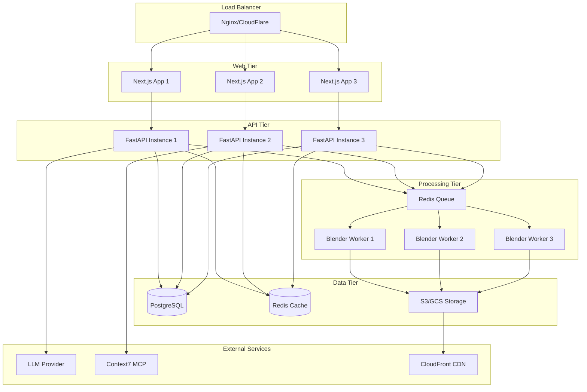

# Phase 4 Implementation Plan: Production Deployment & User Interfaces

## Overview

Phase 4 focuses on transforming the LL3M system from a functional prototype into a production-ready platform. Building on the solid foundation established in Phases 1-3, we'll implement comprehensive user interfaces, deployment infrastructure, advanced features, and enterprise-grade reliability.

## Current State Assessment

### ✅ Completed (Phases 1-3)
- **Phase 1**: Project foundation, Context7 MCP integration, basic Blender execution
- **Phase 2**: Multi-agent system with LangGraph orchestration (PlannerAgent, RetrievalAgent, CodingAgent)
- **Phase 3**: Visual analysis pipeline (CriticAgent, VerificationAgent), complete refinement system
- Local development environment with LM Studio + Blender integration
- End-to-end testing framework with successful asset generation
- Code quality standards and comprehensive test coverage

### 🎯 Phase 4 Goals
- Production-ready web application and API
- Modern user interfaces for asset creation and management
- Scalable deployment infrastructure
- Advanced features and enterprise capabilities
- Performance optimization and monitoring
- Security and compliance implementation

## Task Breakdown

### Task 1: Web Application & API Development (5 days)
**Priority**: High
**Dependencies**: Phase 2/3 workflow system

#### 1.1 FastAPI Production API
```python
from fastapi import FastAPI, BackgroundTasks, WebSocket, Depends
from fastapi.security import HTTPBearer, HTTPAuthorizationCredentials
from fastapi.middleware.cors import CORSMiddleware
from fastapi.middleware.gzip import GZipMiddleware

class ProductionAPI:
    """Enterprise-grade FastAPI application."""

    def __init__(self):
        self.app = FastAPI(
            title="LL3M API",
            description="Large Language 3D Modelers API",
            version="1.0.0",
            docs_url="/api/docs",
            redoc_url="/api/redoc"
        )
        self._setup_middleware()
        self._setup_routes()
        self._setup_websockets()

    def _setup_middleware(self):
        self.app.add_middleware(
            CORSMiddleware,
            allow_origins=["*"],  # Configure for production
            allow_credentials=True,
            allow_methods=["*"],
            allow_headers=["*"],
        )
        self.app.add_middleware(GZipMiddleware, minimum_size=1000)

    @app.post("/api/v1/assets/generate")
    async def generate_asset(
        request: GenerateAssetRequest,
        background_tasks: BackgroundTasks,
        user: User = Depends(get_current_user)
    ) -> AssetResponse:
        """Generate new 3D asset from text prompt."""
        # Queue generation task
        # Return job ID for polling
        # Implement rate limiting per user
        pass

    @app.post("/api/v1/assets/{asset_id}/refine")
    async def refine_asset(
        asset_id: str,
        request: RefineAssetRequest,
        background_tasks: BackgroundTasks,
        user: User = Depends(get_current_user)
    ) -> AssetResponse:
        """Refine existing asset with user feedback."""
        pass

    @app.get("/api/v1/assets/{asset_id}/status")
    async def get_asset_status(
        asset_id: str,
        user: User = Depends(get_current_user)
    ) -> AssetStatusResponse:
        """Get real-time generation status."""
        pass

    @app.websocket("/api/v1/assets/{asset_id}/stream")
    async def stream_generation_progress(
        websocket: WebSocket,
        asset_id: str
    ):
        """Stream real-time generation progress."""
        # WebSocket connection for live updates
        # Progress indicators, intermediate screenshots
        # Error reporting and recovery options
        pass
```

#### 1.2 Asset Management System
```python
class AssetManager:
    """Production asset storage and versioning system."""

    async def store_asset(
        self,
        asset: Asset,
        user_id: str,
        metadata: AssetMetadata
    ) -> str:
        # Cloud storage integration (AWS S3, Google Cloud)
        # Asset versioning and history
        # Metadata extraction and indexing
        # CDN distribution setup
        pass

    async def export_asset(
        self,
        asset_id: str,
        export_format: ExportFormat,
        quality_settings: QualitySettings
    ) -> ExportResult:
        # Multi-format export (GLTF, OBJ, FBX, USDZ)
        # Quality optimization for different use cases
        # Batch processing capabilities
        # Asset validation and compliance checks
        pass

    async def generate_previews(
        self,
        asset_id: str,
        preview_configs: List[PreviewConfig]
    ) -> List[PreviewResult]:
        # Multiple viewing angles and lighting setups
        # Animated previews and turnarounds
        # Thumbnail generation for galleries
        # AR/VR preview formats
        pass
```

#### 1.3 User Authentication & Authorization
```python
class AuthenticationSystem:
    """JWT-based authentication with role-based access control."""

    async def authenticate_user(
        self,
        credentials: UserCredentials
    ) -> AuthResult:
        # JWT token generation
        # Multi-factor authentication support
        # OAuth integration (Google, GitHub, etc.)
        # API key management for programmatic access
        pass

    async def authorize_request(
        self,
        user: User,
        resource: str,
        action: str
    ) -> bool:
        # Role-based access control (RBAC)
        # Resource-level permissions
        # Usage quota enforcement
        # Audit logging
        pass
```

### Task 2: Modern Web Interface (4 days)
**Priority**: High
**Dependencies**: Task 1.1 (API)

#### 2.1 React/Next.js Frontend Application
```typescript
// Next.js 14+ with App Router and TypeScript
interface LL3MWebApp {
  // Asset Creation Interface
  CreationWorkflow: React.FC<{
    onAssetGenerated: (asset: Asset) => void;
    onProgress: (progress: GenerationProgress) => void;
  }>;

  // Real-time Asset Gallery
  AssetGallery: React.FC<{
    assets: Asset[];
    onSelect: (asset: Asset) => void;
    filters: GalleryFilters;
  }>;

  // Interactive 3D Viewer
  AssetViewer: React.FC<{
    assetUrl: string;
    viewerOptions: ViewerOptions;
    onInteraction: (interaction: ViewerInteraction) => void;
  }>;

  // Refinement Interface
  RefinementPanel: React.FC<{
    asset: Asset;
    suggestions: Issue[];
    onRefine: (feedback: string) => void;
  }>;
}
```

#### 2.2 Advanced UI Components
- **3D Asset Viewer**: Three.js/React Three Fiber integration
- **Real-time Progress**: WebSocket-based live updates
- **Drag-and-Drop**: File upload and asset management
- **Mobile-Responsive**: Progressive Web App capabilities
- **Dark/Light Mode**: Comprehensive theming system
- **Keyboard Shortcuts**: Power user workflow optimization

#### 2.3 User Experience Features
```typescript
interface UXFeatures {
  // Intelligent prompt assistance
  promptSuggestions: (partial: string) => Promise<string[]>;

  // Asset templates and presets
  templateLibrary: Template[];

  // Collaborative features
  assetSharing: (assetId: string, permissions: SharePermissions) => void;

  // Version control interface
  assetHistory: (assetId: string) => AssetVersion[];

  // Export optimization
  exportWizard: (asset: Asset) => ExportConfiguration;
}
```

### Task 3: Production Deployment Infrastructure (4 days)
**Priority**: High
**Dependencies**: Task 1 (API), Task 2 (Frontend)

#### 3.1 Containerization & Orchestration
```dockerfile
# Multi-stage Docker build for LL3M API
FROM python:3.11-slim as base
WORKDIR /app
COPY requirements.txt .
RUN pip install --no-cache-dir -r requirements.txt

FROM base as blender-runtime
# Install Blender and system dependencies
RUN apt-get update && apt-get install -y \
    blender \
    xvfb \
    libgl1-mesa-glx \
    && rm -rf /var/lib/apt/lists/*

FROM blender-runtime as production
COPY . .
EXPOSE 8000
CMD ["uvicorn", "src.api:app", "--host", "0.0.0.0", "--port", "8000"]
```

```yaml
# Kubernetes deployment configuration
apiVersion: apps/v1
kind: Deployment
metadata:
  name: ll3m-api
spec:
  replicas: 3
  selector:
    matchLabels:
      app: ll3m-api
  template:
    metadata:
      labels:
        app: ll3m-api
    spec:
      containers:
      - name: ll3m-api
        image: ll3m/api:latest
        resources:
          requests:
            memory: "2Gi"
            cpu: "1"
          limits:
            memory: "4Gi"
            cpu: "2"
        env:
        - name: ENVIRONMENT
          value: "production"
        - name: DATABASE_URL
          valueFrom:
            secretKeyRef:
              name: ll3m-secrets
              key: database-url
```

#### 3.2 Cloud Infrastructure (AWS/GCP)
```yaml
# Terraform infrastructure as code
resource "aws_ecs_cluster" "ll3m_cluster" {
  name = "ll3m-production"

  setting {
    name  = "containerInsights"
    value = "enabled"
  }
}

resource "aws_s3_bucket" "asset_storage" {
  bucket = "ll3m-assets-prod"

  versioning {
    enabled = true
  }

  lifecycle_configuration {
    rule {
      enabled = true
      transition {
        days          = 30
        storage_class = "STANDARD_IA"
      }
      transition {
        days          = 90
        storage_class = "GLACIER"
      }
    }
  }
}

resource "aws_cloudfront_distribution" "asset_cdn" {
  origin {
    domain_name = aws_s3_bucket.asset_storage.bucket_regional_domain_name
    origin_id   = "S3-ll3m-assets"
  }

  default_cache_behavior {
    target_origin_id = "S3-ll3m-assets"
    cached_methods   = ["GET", "HEAD"]
    compress         = true
  }
}
```

#### 3.3 CI/CD Pipeline
```yaml
# GitHub Actions workflow
name: LL3M Production Deploy

on:
  push:
    branches: [ main ]

jobs:
  test:
    runs-on: ubuntu-latest
    steps:
    - uses: actions/checkout@v3
    - name: Run tests
      run: |
        python -m pytest tests/ --cov=src --cov-report=xml
    - name: Upload coverage
      uses: codecov/codecov-action@v3

  build-and-deploy:
    needs: test
    runs-on: ubuntu-latest
    steps:
    - name: Build Docker image
      run: |
        docker build -t ${{ secrets.DOCKER_REGISTRY }}/ll3m:${{ github.sha }} .
        docker push ${{ secrets.DOCKER_REGISTRY }}/ll3m:${{ github.sha }}

    - name: Deploy to production
      run: |
        kubectl set image deployment/ll3m-api \
          ll3m-api=${{ secrets.DOCKER_REGISTRY }}/ll3m:${{ github.sha }}
```

### Task 4: Advanced Features & Enterprise Capabilities (4 days)
**Priority**: Medium
**Dependencies**: Task 1-3

#### 4.1 Batch Processing System
```python
class BatchProcessor:
    """Handle multiple asset generation requests efficiently."""

    async def process_batch(
        self,
        requests: List[GenerationRequest],
        user_id: str,
        batch_config: BatchConfig
    ) -> BatchResult:
        # Queue management with priority handling
        # Resource optimization for parallel processing
        # Progress tracking for entire batch
        # Failure handling and partial results
        pass

    async def schedule_recurring_batch(
        self,
        schedule: CronSchedule,
        template: BatchTemplate
    ) -> ScheduledBatch:
        # Automated batch processing
        # Template-based generation campaigns
        # Resource scheduling optimization
        # Result aggregation and reporting
        pass
```

#### 4.2 Asset Analytics & Insights
```python
class AssetAnalytics:
    """Advanced analytics and insights for generated assets."""

    async def analyze_generation_patterns(
        self,
        user_id: str,
        time_range: DateRange
    ) -> AnalyticsReport:
        # Generation success rates and failure analysis
        # Popular prompts and template usage
        # Quality improvement trends
        # User behavior insights
        pass

    async def generate_quality_report(
        self,
        asset_ids: List[str]
    ) -> QualityReport:
        # Automated quality assessment
        # Geometric complexity analysis
        # Material and texture quality metrics
        # Performance optimization recommendations
        pass
```

#### 4.3 Plugin Architecture
```python
class PluginSystem:
    """Extensible plugin architecture for custom functionality."""

    def register_plugin(
        self,
        plugin: LL3MPlugin,
        permissions: PluginPermissions
    ) -> PluginRegistration:
        # Dynamic plugin loading
        # Sandbox execution environment
        # API access control
        # Plugin marketplace integration
        pass

    async def execute_plugin_hook(
        self,
        hook_name: str,
        context: HookContext
    ) -> HookResult:
        # Pre/post generation hooks
        # Custom refinement algorithms
        # Export format extensions
        # Third-party service integrations
        pass
```

### Task 5: Performance Optimization & Monitoring (3 days)
**Priority**: High
**Dependencies**: All previous tasks

#### 5.1 Performance Optimization
```python
class PerformanceOptimizer:
    """System-wide performance monitoring and optimization."""

    async def optimize_blender_execution(
        self,
        code: str,
        optimization_level: OptimizationLevel
    ) -> OptimizedCode:
        # Code analysis and optimization
        # Resource usage prediction
        # Execution time estimation
        # Memory usage optimization
        pass

    async def cache_management(
        self,
        cache_strategy: CacheStrategy
    ) -> CacheConfig:
        # Intelligent caching of generated assets
        # Template and documentation caching
        # Redis/Memcached integration
        # Cache invalidation strategies
        pass
```

#### 5.2 Monitoring & Observability
```python
# Prometheus metrics integration
from prometheus_client import Counter, Histogram, Gauge

generation_requests_total = Counter(
    'll3m_generation_requests_total',
    'Total number of generation requests',
    ['status', 'user_type']
)

generation_duration = Histogram(
    'll3m_generation_duration_seconds',
    'Time spent generating assets',
    ['complexity_level']
)

active_generations = Gauge(
    'll3m_active_generations',
    'Number of currently active generations'
)

class MonitoringSystem:
    """Comprehensive monitoring and alerting system."""

    def setup_health_checks(self):
        # API endpoint health monitoring
        # Blender process health checks
        # Database connectivity monitoring
        # External service availability
        pass

    def configure_alerting(self):
        # Error rate thresholds
        # Performance degradation alerts
        # Resource usage warnings
        # User experience monitoring
        pass
```

### Task 6: Security & Compliance (3 days)
**Priority**: High
**Dependencies**: Task 1-3

#### 6.1 Security Implementation
```python
class SecurityManager:
    """Comprehensive security and compliance system."""

    async def validate_blender_code(
        self,
        code: str,
        security_level: SecurityLevel
    ) -> ValidationResult:
        # AST-based code analysis
        # Malicious code detection
        # Resource usage limits
        # Sandbox execution enforcement
        pass

    async def encrypt_sensitive_data(
        self,
        data: Dict[str, Any],
        encryption_key: str
    ) -> EncryptedData:
        # End-to-end encryption for user data
        # Secure asset storage
        # API key protection
        # PII handling compliance
        pass

    def audit_user_actions(
        self,
        user_id: str,
        action: str,
        resource: str,
        timestamp: datetime
    ):
        # Comprehensive audit logging
        # Compliance reporting
        # Suspicious activity detection
        # Data retention policies
        pass
```

#### 6.2 Compliance Framework
- **GDPR**: User data protection and right to deletion
- **SOC 2**: Security and availability controls
- **ISO 27001**: Information security management
- **HIPAA**: Healthcare data protection (if applicable)
- **Terms of Service**: Asset ownership and usage rights

### Task 7: Testing & Quality Assurance (3 days)
**Priority**: High
**Dependencies**: All previous tasks

#### 7.1 Comprehensive Test Suite
```python
class ProductionTestSuite:
    """Production-grade testing framework."""

    async def run_load_tests(
        self,
        test_scenarios: List[LoadTestScenario]
    ) -> LoadTestResults:
        # Concurrent user simulation
        # API endpoint stress testing
        # Database performance under load
        # Asset generation throughput testing
        pass

    async def run_security_tests(self,
        test_cases: List[SecurityTestCase]
    ) -> SecurityTestResults:
        # Penetration testing automation
        # Code injection prevention
        # Authentication bypass attempts
        # Data exposure vulnerability scanning
        pass

    async def run_compatibility_tests(
        self,
        platforms: List[Platform]
    ) -> CompatibilityResults:
        # Cross-browser testing
        # Mobile device compatibility
        # Blender version compatibility
        # Export format validation
        pass
```

#### 7.2 Quality Gates
- **API Response Time**: <200ms for 95th percentile
- **Asset Generation**: <5 minutes for standard complexity
- **System Uptime**: 99.9% availability
- **Test Coverage**: >95% for production code
- **Security Score**: OWASP Top 10 compliance
- **Performance Score**: Lighthouse score >90

## Technical Architecture

### Production Architecture Diagram


### Scalability Considerations
```python
class ScalabilityConfig:
    """Configuration for horizontal and vertical scaling."""

    horizontal_scaling = {
        "api_instances": {"min": 3, "max": 20, "target_cpu": 70},
        "worker_instances": {"min": 2, "max": 50, "queue_threshold": 100},
        "web_instances": {"min": 2, "max": 10, "target_latency": "200ms"}
    }

    vertical_scaling = {
        "api_resources": {"cpu": "2-8", "memory": "4-16Gi"},
        "worker_resources": {"cpu": "4-16", "memory": "8-32Gi"},
        "database_resources": {"cpu": "4-32", "memory": "16-128Gi"}
    }

    auto_scaling_policies = {
        "scale_out_threshold": 80,  # CPU percentage
        "scale_in_threshold": 30,
        "cooldown_period": 300,  # seconds
        "health_check_grace_period": 180
    }
```

## Implementation Strategy

### Development Approach
1. **API-First Development**: Complete API implementation before UI
2. **Progressive Deployment**: Blue-green deployments with feature flags
3. **Performance-Driven**: Continuous performance monitoring and optimization
4. **Security by Design**: Security considerations at every development stage

### Technology Stack
```yaml
Frontend:
  - Next.js 14+ (React 18+)
  - TypeScript 5+
  - Tailwind CSS
  - Three.js/React Three Fiber
  - Zustand (state management)

Backend:
  - FastAPI 0.104+
  - Python 3.11+
  - PostgreSQL 15+
  - Redis 7+
  - Celery (task queue)

Infrastructure:
  - Docker & Kubernetes
  - AWS/GCP cloud services
  - CloudFlare CDN
  - Prometheus/Grafana monitoring
  - Terraform (Infrastructure as Code)

Development:
  - GitHub Actions CI/CD
  - pytest (testing)
  - pre-commit hooks
  - SonarQube (code quality)
```

### Database Schema
```sql
-- Core entities for production system
CREATE TABLE users (
    id UUID PRIMARY KEY DEFAULT gen_random_uuid(),
    email VARCHAR(255) UNIQUE NOT NULL,
    name VARCHAR(255) NOT NULL,
    subscription_tier VARCHAR(50) DEFAULT 'free',
    created_at TIMESTAMP DEFAULT NOW(),
    updated_at TIMESTAMP DEFAULT NOW()
);

CREATE TABLE assets (
    id UUID PRIMARY KEY DEFAULT gen_random_uuid(),
    user_id UUID REFERENCES users(id),
    name VARCHAR(255) NOT NULL,
    prompt TEXT NOT NULL,
    status VARCHAR(50) DEFAULT 'pending',
    blender_file_url TEXT,
    preview_image_url TEXT,
    metadata JSONB,
    created_at TIMESTAMP DEFAULT NOW(),
    updated_at TIMESTAMP DEFAULT NOW()
);

CREATE TABLE generation_jobs (
    id UUID PRIMARY KEY DEFAULT gen_random_uuid(),
    asset_id UUID REFERENCES assets(id),
    status VARCHAR(50) DEFAULT 'queued',
    progress INTEGER DEFAULT 0,
    error_message TEXT,
    execution_log TEXT,
    started_at TIMESTAMP,
    completed_at TIMESTAMP,
    created_at TIMESTAMP DEFAULT NOW()
);

-- Indexes for performance
CREATE INDEX idx_assets_user_id ON assets(user_id);
CREATE INDEX idx_assets_status ON assets(status);
CREATE INDEX idx_generation_jobs_status ON generation_jobs(status);
```

## Success Criteria

### Technical Metrics
- [ ] API response time <200ms (95th percentile)
- [ ] System uptime >99.9%
- [ ] Asset generation success rate >95%
- [ ] Support for 1000+ concurrent users
- [ ] Complete test coverage >95%
- [ ] Zero critical security vulnerabilities

### Business Metrics
- [ ] User onboarding completion >80%
- [ ] Asset generation completion rate >90%
- [ ] User retention rate >70% (30 days)
- [ ] API error rate <0.1%
- [ ] Customer satisfaction score >4.5/5

### Production Requirements
- [ ] Multi-region deployment capability
- [ ] Automated disaster recovery
- [ ] Comprehensive monitoring and alerting
- [ ] SOC 2 Type II compliance
- [ ] GDPR compliance implementation
- [ ] Mobile-responsive web application

## Risk Management

### Technical Risks
1. **Scale Challenges**: Mitigation through horizontal scaling and caching
2. **Blender Stability**: Mitigation through process isolation and health monitoring
3. **Performance Bottlenecks**: Mitigation through comprehensive monitoring and optimization
4. **Security Vulnerabilities**: Mitigation through regular audits and penetration testing

### Business Risks
1. **User Adoption**: Mitigation through intuitive UX and comprehensive onboarding
2. **Competition**: Mitigation through unique features and superior quality
3. **Cost Management**: Mitigation through efficient resource utilization and auto-scaling
4. **Compliance Issues**: Mitigation through proactive compliance framework

## Timeline

**Total Duration**: 23 days (4.5 weeks)

### Week 1: Foundation & API (Days 1-5)
- Days 1-5: Web Application & API Development
- Complete FastAPI production implementation
- User authentication and authorization system

### Week 2: Frontend & UI (Days 6-9)
- Days 6-9: Modern Web Interface
- React/Next.js application with 3D viewer
- Real-time progress tracking and asset management

### Week 3: Infrastructure & Deployment (Days 10-13)
- Days 10-13: Production Deployment Infrastructure
- Containerization, orchestration, and CI/CD pipeline
- Cloud infrastructure setup and configuration

### Week 4: Advanced Features (Days 14-17)
- Days 14-17: Advanced Features & Enterprise Capabilities
- Batch processing, analytics, and plugin architecture
- Performance optimization implementation

### Week 4.5: Testing & Launch (Days 18-23)
- Days 18-20: Performance Optimization & Monitoring
- Days 21-23: Security & Compliance + Final Testing
- Production deployment and go-live preparation

## Deployment Strategy

### Phased Rollout
1. **Alpha Release**: Internal testing with limited feature set
2. **Beta Release**: Closed beta with select users for feedback
3. **Production Release**: Public launch with full feature set
4. **Post-Launch**: Continuous monitoring and iterative improvements

### Feature Flags
```python
class FeatureFlags:
    """Dynamic feature control for gradual rollout."""

    BATCH_PROCESSING = "batch_processing_enabled"
    ADVANCED_ANALYTICS = "analytics_dashboard_enabled"
    PLUGIN_SYSTEM = "plugin_system_enabled"
    MOBILE_APP = "mobile_application_enabled"

    @staticmethod
    def is_enabled(feature: str, user_id: str = None) -> bool:
        # Dynamic feature flag evaluation
        # A/B testing support
        # Gradual rollout percentages
        # User-specific overrides
        pass
```

## Next Steps

1. **Environment Setup**: Configure production cloud infrastructure
2. **API Development**: Implement core FastAPI endpoints with authentication
3. **Frontend Framework**: Set up Next.js application with TypeScript
4. **Database Design**: Implement production database schema and migrations
5. **Containerization**: Create Docker containers and Kubernetes manifests
6. **CI/CD Pipeline**: Set up automated testing and deployment workflow
7. **Monitoring Setup**: Configure comprehensive monitoring and alerting systems
8. **Security Implementation**: Implement security measures and compliance framework
9. **Load Testing**: Conduct thorough performance and scalability testing
10. **Production Deployment**: Deploy to production environment with monitoring

This Phase 4 implementation transforms LL3M from a functional prototype into a production-ready platform capable of serving thousands of users while maintaining high performance, security, and reliability standards.
